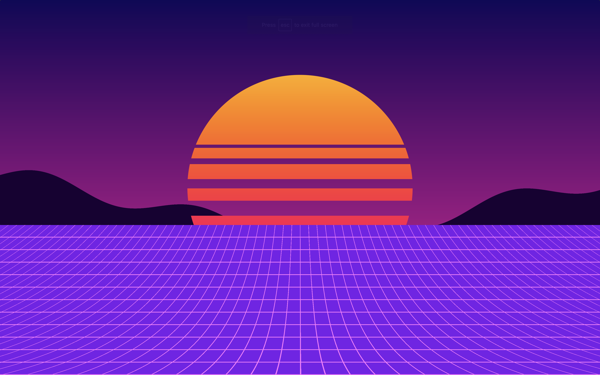



I made this effect during a Genuary prompt, in shadertoy [Link](https://www.shadertoy.com/view/3ltyDl)
Each part is programmatically generated.

First starting by composing this image through code

And then producing this ripple interference effect, that is used to displace the UV sampling of the image above.
<video controls src="Genuary9_Interferences_Flowmap.mov" width="300px" title="Title"></video>

