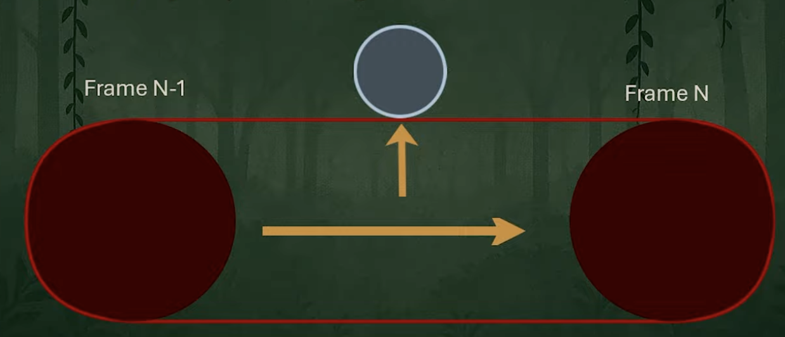

> This page is part of my "graphics notebook" series, where I keep notes on graphics concepts as I learn about them, to serve as a reference.

# Physics Simulation

## Position Based Dynamics
PBD is a physics solver where nodes have properties like position, orientation, mass, ... and each node (or particle) is connected to others using constraints. 
Examples of constraints: Length (keeps desired distance between nodes), angle (keeps desired angle between series of nodes), collision (resolves overlaps), volume (keeps desired volume between collection of connected nodes), ...

Solving all the constraints in one go can be computationally complex & very memory consuming, so the usual approach is to use an iterative solver (like Jacobi/Gauss-Seidl). The constraints are iteratively refined by moving nodes to satisfy them. Typically a fixed number of iterations is applied, that works for an asset, instead of computing the residual value (amount of error vs the converged solution), to reduce computational cost and branching behaviour.

## XPBD - Extended Position Based Dynamics
This is an improvement on the PBD method, which addresses the stiffness nature being affected by the solver iteration count or timestep. It introduced a compliance parameter (inverse of stiffness).
Secondly XPBD uses an implicit integration, whereas PBD uses an explicit integration algorithm. The implicit integration resolves to a more stable result and handles infintely stiff surfaces much better.
Finally, XPBD offers a faster convergence due to the better handling of stiffness and the sub-stepping part of the algorithm. 

## Integration schemes
Integration is part of Calculus, and calculates the sum of segments under a curve.
The curve in this case defines the position of a node over time, as it undergoes forces.
Due to collisions and constraints, it's not practical to solve the final positions directly.
So iterative methods are a popular way to gradually approach the final position, starting from a guess and moving along gradients towards to end result.

### Explicit integration:
The explicit integration scheme takes the state of the system "now", and uses it to calculate the next time step state.

eg: 

`newVelocity = oldVelocity + oldAcceleration * deltaTime`

`newPosition = oldPosition + oldVelocity * deltaTime`

in both cases, the previous frame's acceleration and acceleration were used to take a step forward.

It's cheaper computationally, but is less stable with large timesteps, so an integration with many iterations of small timesteps should be the ideal use of this scheme. But even then, it is more likely to diverge compared to the Implicit integration. 

### Implicit integration

This method uses the future (unknown) velocity and acceleration to determine the next position and velocity.

eg: 

`newVelocity = oldVelocity + newAcceleration * deltaTime`

`newPosition = oldPosition + newVelocity * deltaTime`

In this case, the `newPosition` value was calculated using the newly computed `newVelocity`, producing more accurate gradients for the step we're taking.
`newAcceleration` may just be constant in a situation of a freefall, otherwise it's input dependent.

The true complexity of implicit methods appears when the acceleration (force) depends on the new, unknown position or new, unknown velocity.

## Swept collisions

Swept collisions is the idea of geometrically model the space a collision primitive covered over the distance travelled during a time step. And comparing overlaps between the colliding bodies (like PBD nodes) and this volume, to resolve these.
This approach can be is more expensive than substepping a colliding shape position between the previous frame and new frame, depending on how many substeps are taken. But often substepping is insufficient to properly represent the full volume, and may fail to push objects fully out of it's path. Better quality is achieved with swept collisions.

In this example, a sphere is being swept between it's position on the previous and current frame, to create a cylinder volume, and push a node out towards it's closest surface, along the normal.

## Vertex Block Descent
...