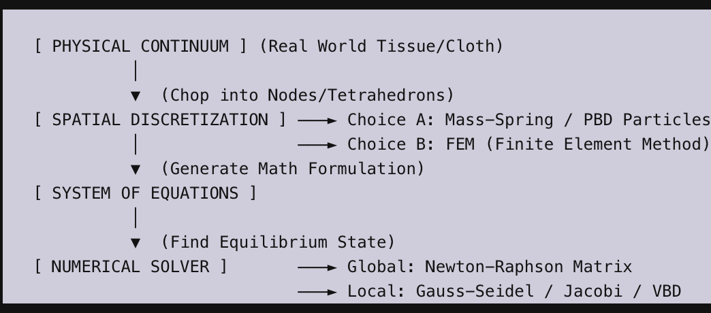
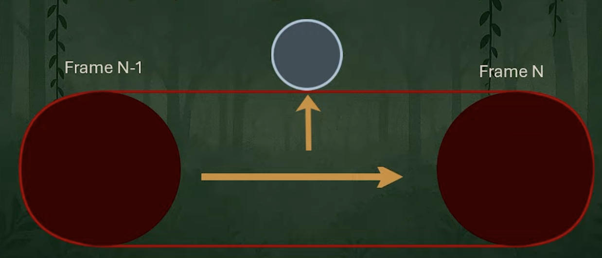

> This page is part of my "graphics notebook" series, where I keep notes on graphics concepts as I learn about them, to serve as a reference.

# Physics Simulation

A physics simulation is a framework for replicating real-world physical behaviours with a digital simulation. Continuous physical matter is broken down into interactive particles, springs or finite elements; and then these elements are stepped through time as forces are applied to them.
Because multi-body constraints and collisions turn these setups into complex, highly non-linear algebraic problems, modern physics frameworks rely on numerical optimization routines to iteratively guide the simulation toward stable, minimized energy states.

## Integration schemes
Integration (Calculus) in the context of a physics simulation, is the process of accumulating changes over time.
A velocity curve accumulated (or "integrated") over some time results in a position update. The integration of an acceleration curve results in the velocity. A physics simulation considers the forces and constraints on the system's elements to find their position at a given time.

Due to the number of degrees of freedom, very large matrices would be required to represent each linear system, which in turn would require too much memory to represent and complex decomposition steps to solve. Handling of collisions and constraints would also complicate this further. It's therefore not practical to solve the final positions directly.
Instead, iterative methods are a popular way to gradually approach the final position, starting from a guess and moving along gradients towards a more accurate end result (see Jacobi / Gauss-Seidel).

### Explicit integration:
Explicit integration schemes take the state of the system "now" and use it to calculate the state at the next time step.

eg: 

`newVelocity = oldVelocity + oldAcceleration * deltaTime`

`newPosition = oldPosition + oldVelocity * deltaTime`

In both cases, the previous frame's acceleration and velocity were used to take a step forward.

It's cheaper computationally but is less stable as the size of the timesteps may cause the system to undershoot or overshoot the destination.
If the timestep is too coarse of a unit to move by, we end up with oscillating motion which snowballs until an explosion of the simulation.
Many & small timesteps are ideal for this integration scheme, which is usually cheaper computationally, but comes with the consequence of being unstable.

### Implicit integration
With implicit integration we're iteratively solving the equations describing the forces applied to an object, so that an initial guess for its next position is refined until it is in a position that is consistent with all the forces applied to it at that new position.
 
Take this calculation of acceleration and integration of velocity and acceleration based on the old position to calculate a new position:

`acceleration = force_at(pos_new) / m`        ← forces (spring/gravity/...) at the new position

`pos_new = pos_old + velocity * dt + ( 0.5 * acceleration * dt²)`

Looking closely, `pos_new` is on both sides of the second equation.
You can't just shuffle the equation around to get a solution. You have to find the `pos_new` that satisfies both sides simultaneously — that's the "solve" step.

How do we do that? By iteratively refining our first guess:

1. Start with the explicit integration result as the first guess.
2. Compute the forces at this new position & the derivatives of those forces (stiffness matrix ie: the Hessian/Jacobian)
3. Take a step forward based on the current position and those calculated forces divided by the derivatives. This gives a new position guess that is more accurate.
Repeat steps 2 & 3 until the position stops changing.

When it stops changing, you've found the position where forces and motion to get there agree — the consistent solution.

#### Concretely

Picture a chain of interconnected links. When one moves old_pos to new_pos over timestep dt, that motion implies an acceleration:

`a_implied` = 2 * (pos_new - pos_old - v\*dt) / dt²

(This is just rearranging pos_new = pos_old + v \*dt + (0.5 * **a** \* dt²))

Newton says:
`f = m*a`
so
`a = f/m`

ie:
`a_physics` = 2 * (spring_forces\_at(pos_new) + gravity) / mass

So our goal is to match `a_implied` to `a_physics`, ensuraing that the acceleration implied by the motion matches the forces that exist at the destination.
In other words: we make sure to apply the right force to displace an object to where it should be under the forces it will be under at the next frame, to be physically correct.



## Solvers
The role of the solver is to apply the integration scheme, there are different methods described below.
All of them try to reduce the strain in the system to lower the energy to a minimum while respecting constraints.
eg: a hanging chain is pulled down by gravity, but can't exceed it's length to move further down.

Here's an interactive tool to get a sense of this concept.


### Newton Method
The Newton method is an approach to find the roots of equations to solve them, traditionally all in one go.
This is impractical for real-time applications, so a local application of the Newton method can be used instead (see VBD).Iterative  methods like Jacobi & Gauss-Seidel progressively solve the constraints one by one instead, it is computationally lighter but also converges slower.

We use the Newton method to find configurations where the sum of forces on any given object in the system is zero (or the lowest possible value. Constraints prevent an object from ever reaching zero force, eg: a rope pulls one way, and gravity pulls another way).

The Gradient (1st order derivative) describes the net forces applied on an object, the Curvature/Stiffness (Hessian) (2nd order derivative) describe how quickly the net forces change.
Together we calculate an accurate step: step_size = net_force / stiffness.

### Jacobi
Solves position updates all at once in parallel, but uses the previous iteration's old positions as inputs to calculate the next frame's positions.
This means forces can only travel through the physics body one node per iteration, which can be slow.

Using Jacobi means there are conflicts in the resolution of positions (neighbours pull in different directions and disagree ), which leads to oscillation and instability. The patch for this is to apply under-relaxation, ie apply a multiplier to the deltas (eg: \* 0.5) so they converge calmly and don't overshoot.

### Gauss-Seidel
Solves position updates serially, but in the example of a chain, when updating the next link we can read the updated position of the previous link. Therefore forces travel much faster through the physics body.
Gauss-Seidel doesn't require underrelaxation nearly as much (or at all) and therefore converges faster.

### PBD - Position Based Dynamics
PBD is a physics solver where nodes have properties like position, orientation, mass, ... and each node (or particle) is connected to others using constraints. 
Examples of constraints: Length (keeps desired distance between nodes), angle (keeps desired angle between series of nodes), collision (resolves overlaps), volume (keeps desired volume between collection of connected nodes), ...

Solving all the constraints in one go can be computationally complex and very memory consuming, so the usual approach is to use an iterative solver (like Jacobi/Gauss-Seidel). The constraints are iteratively refined by moving nodes to satisfy them. Typically a fixed number of iterations is applied that works for an asset, instead of computing the residual value (amount of error vs the converged solution), to reduce computational cost and branching behaviour.

### XPBD - Extended Position Based Dynamics
This is an improvement on the PBD method, which addresses the stiffness nature being affected by the solver iteration count or timestep. It introduced a compliance parameter (inverse of stiffness).
Sub-stepping is also introduced to reduce the local error for every iteration, which means the solver doesn't need to converge as far globally to produce stiff results and look realistic.

Both PBD and XPBD use a semi-implicit solver, they first take a guess at a position using an explicit integration, whilst the constraint resolution loop is of an implicit nature because it solves multiple equations simultaneously.

### VBD - Vertex Block Descent
VBD uses the Newton method, but a "local" variant of it per vertex not as a global solver.

Each "block" is a vertex with 3 DOFs (degrees of freedom). 

This allows us to take multiple small and cheap steps to solve from locally to globally.

VBD proposes to solve the vertices sequentially through Gauss-Seidel method as it converges faster than Jacobi.

To address the serial nature, VBD also proposes the use of graph coloring, so it tries to use the best of both worlds. Assigning one colour for each vertex that doesn't share a link (ie neighbours). Then process one colour at a time (so iteration 1: Red in parallel, then blue in parallel, then iteration 2: red in parallel, then blue in parallel). blue sees the updated positions of red, which leads to faster convergence.

For a single chain, we would be able to rely on just 2 colours: red for the even nodes, blue for the odd nodes
(we can also apply graph colouring on (X)PBD, we just apply the colouring to constraints instead of vertices).

In VBD we only solve the vertex's local 3X3 block using the local hessian, not the full system's hessian, which means it's parallelizable.
The 3×3 structure:
- Diagonal entries: stiffness along x, y, z individually.
- Off-diagonal entries: coupling — how moving in x changes the force in y. For a spring this coupling is real because the spring acts along the link direction d̂, which is generally not axis-aligned.

__The whole VBD loop in plain words__

For each timestep:

1. Predict where each vertex would drift by inertia.
2. For each vertex, look at its forces (gradient) and link stiffness (Hessian).
3. Nudge the vertex toward lower energy — toward satisfying its links and its inertia at once.
4. Make the nudge stable (PSD-project so it never picks a "buckling" direction).
5. Repeat over all vertices a few times until the whole chain settles.



## Appendix

### Toolbox: Numerical Optimization / Root-Finding Algorithms / Mechanics Method

Gradient descent: Take _even_ steps in the opposite direction of the function's gradient, to find the bottom of the parabola bowl.

Newton method: Using the Hessian ( aka: curvature, 2nd derivative) to _scale_ the size of the steps, so for a shallow bowl, the step sizes will be large whereas for a narrow and steep bowl, the steps will be small. 

FEM (Finite Element Method): Is a spatial discretisation method. We use this to set up a physics system that we can solve, and deform a visual surface

### Spring force

Hooke's Law: The force representing the chain link's tendency to return to its rest length. (current length - rest length)
`F = -k (L-Lo) * d̂`
k = stiffness (how strongly it pulls back)

L = current length ( |xCurrentLinkPos - xPrevLinkPos| )

Lo = rest length (constant setup on initialisation)

d̂ : unit vector (direction) along the links

### Positive Definite / Positive Semi-Definite / Indefinite Matrices

These terms describe the shape a matrix represents when used as curvature (like a hessian). 
**Positive definite** : the eigenvalues are all positive, there is a minimum, everywhere curves up away from it.
**Positive semi definite**: positive eigenvalues but at least one is zero - ie: the bowl curves down but the minimum is not a single point there's a flat area there.
**Indefinite**: some eigenvalues are negative: there's no minimum.

**Why this matters for Newton method**
To be able to take a useful Newton step forward, the step has to go towards a minimum. Positive definite is ideal, we will converge. Positive semi definite is borderline, there's no gradient to follow when we reach a flat area. Indefinite is dangerous, it  means the newton step can go uphill, diverging or exploding.

Indefinite matrices can be made safer by clamping negative eigenvalues to zero, turning them to a positive semi definite matrix. This process is called PSD-projection.

The bowl represents how much resistance to the forces we have with the current solve position guess, so that we can move along the bowl down to its minimum, to minimise the resistance - reaching a situation where all the forces are respected as much as possible.

The solver doesn't magically know the best spot. It starts with a guess (usually the inertial prediction) and nudges the vertex toward lower energy — toward the bottom of the bowl.

- Gradient = the net force on the vertex. It literally points "this way reduces energy fastest." Downhill = the direction the forces are pushing.
- Hessian = how stiff the springs feel right now. It tells the solver how big a nudge to make. Stiff links (steep bowl) → small careful step. Floppy links (shallow bowl) → big confident step.
So "moving downhill" = letting the forces pull the vertex toward its equilibrium position, but using the stiffness to take the right-sized step instead of guessing.

__Why the shape (PD / PSD / indefinite) matters physically__
 - Bowl (positive definite) — the forces clearly agree there's one best spot. The vertex slides right to it. Normal, stable case.
 - Flat trough (PSD) — the forces don't fully pin the vertex down; there's a direction where moving it costs nothing (e.g. a link that's exactly at rest length and only one constraint acting). The solver can't decide along that line, so it just needs a tiny stabilizing nudge to pick a spot.
 - Saddle (indefinite) — the math says "you could lower energy by moving away" in some direction. Physically this is the compressed link case: a squashed spring wants to buckle sideways, and the curvature goes negative. If the solver trusts that, it can fling the vertex off in a wild direction and blow up the simulation.

That's why VBD PSD-projects the Hessian: it tells the solver "pretend the bowl is never a saddle," so each vertex always takes a calm, stable step toward equilibrium instead of exploding.

In one sentence: the bowl is the energy cost of each possible vertex position, "downhill" is the direction the forces pull, and the Hessian just makes sure each vertex steps toward its rest position by a sensible, stable amount instead of overshooting or exploding.

### Swept collisions

Swept collisions is the idea of geometrically model the space a collision primitive covered over the distance travelled during a time step. And comparing overlaps between the colliding bodies (like PBD nodes) and this volume, to resolve these.
This approach is more expensive than substepping a colliding shape position between the previous frame and new frame, depending on how many substeps are taken. But often substepping is insufficient to properly represent the full volume and may fail to push objects fully out of its path. Better quality is achieved with swept collisions.

In this example, a sphere is being swept between its position on the previous and current frame, to create a capsule volume, and push a node out towards its closest surface, along the normal.
