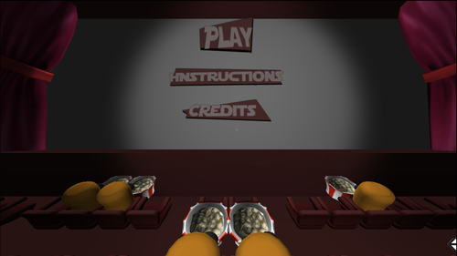
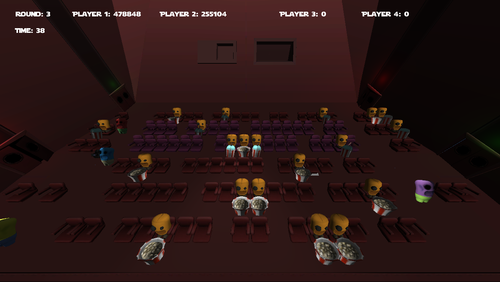
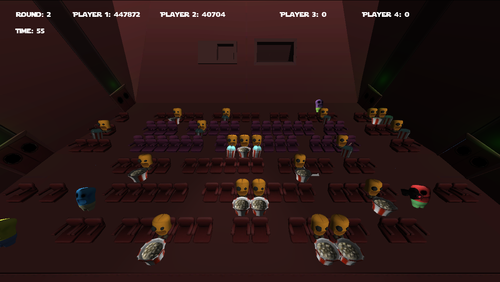
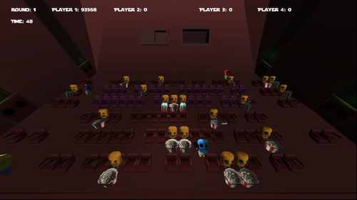

### Description
In this Game Jam project, using the theme of "Film & Cinema", one player is a pirate trying to film the movie by standing still in the middle of the cinema, betweens a maze made of rows, whilst the others try to catch them.

### Role: Programmer & Design

#### Contributions
Arrrr Rated is a game I worked on within a 24 hours game jam at the Arch Creatives with two artists and a musician. It’s a game made with Unity3D.  My role during a tedious non-stop 24 hours, without any sleep, was to write all the code, assemble the level in collaboration with the artists who made the level pieces separately and eating a lot of pizza & sweets.

#### Platforms:
PC

