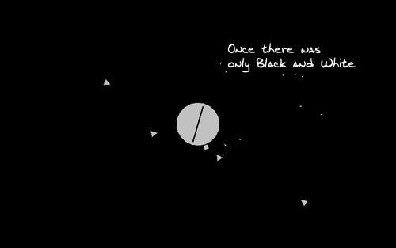
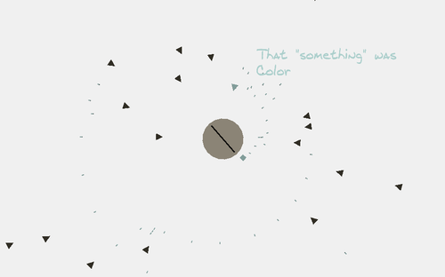
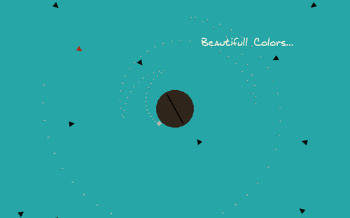

### Description
Color is a Game Jam project I worked on during 48 hours. The graphics of this game were very minimalistic and my goal was to explore which color combinations went well together, and learn from it. The goal in this game is to rotate around the circle in the middle of the screen, which represents a planet, and shoot enemies coming from all sides before they hit the planet. Every level allows you to shoot a bit faster, to defend your planet against growing numbers of enemies.

I was the only programmer on the project, while a musician made the music for the game.

### Role: Programming & Level Design

#### Platforms:
[PC](http://www.kongregate.com/games/snipercommand/color) 

