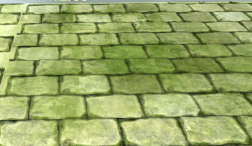


### Description
Experience exciting, tactical, PvP multiplayer arena battles with stunning visuals and audio based on the epic fantasy universe, Warhammer Age of Sigmar.

### Role: Senior Gameplay Engineer

#### Contributions
I lead part of the team to implement new units on a regular basis for montly updates, with new abilites and visual features. In this role I served both a lead gameplay engineer, scrum master and managed priorities with other disciplines like Art & Design, to deliver the content on time and on quality. I also worked on graphics effects, and the adoption of PBR material. Prior to initial release I established a scalable process to develop new units, using behaviour trees and composition-based design.

#### Platforms:

[iOS](http://apps.apple.com/my/app/warhammer-aos-realm-war/id1372693279) | 
[Google Play](https://play.google.com/store/apps/details?id=com.PixelToys.Sigmar&hl=en_US)










