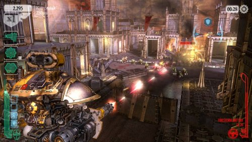
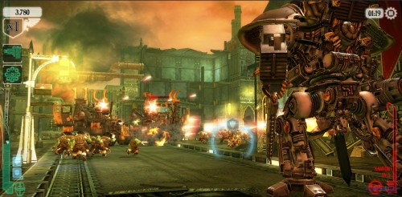
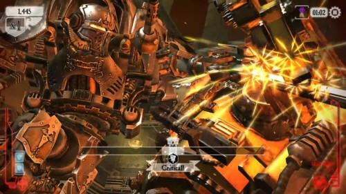


### Description
Step into the epic Warhammer 40,000 universe with Warhammer 40,000: Freeblade! Take control of a mighty Imperial Knight and embark on a thrilling journey of honor, redemption, and vengeance. Engage in over 170 intense single-player missions, team up with the Dark Angels Space Marines, and fight against the twisted forces of Chaos.

#### Accolades
- Featured game to launch iPhone 6s during WWDC (and again during later WWDCs)
- iOS App Store ‘Best of 2015’ Awards Winner
-  Play Store 'Best game of the year' award nomination

### Role: Software Engineer
#### Contributions: 
- Gameplay
- UI
- Backend
- Multi-player
- Metagame Systems
- Shaders
- Optimisation

#### Platforms:

[iOS](https://itunes.apple.com/gb/app/warhammer-40-000-freeblade/id1043640363) | 
[Google Play](https://play.google.com/store/apps/details?id=com.pixeltoys.freeblade) | 
[Facebook Gameroom](https://apps.facebook.com/408309252671071/?fb_source=rightcolumn) | 
[Microsoft store](https://www.microsoft.com/en-us/p/warhammer-40-000-freeblade/9mwtnmbb5hz1)

