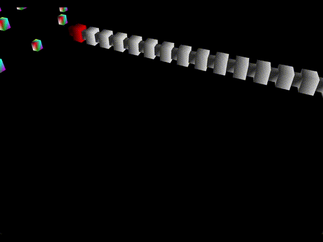

### Role: Author

AstroDX12 is my toy DirectX12 renderer, which I use to deepen my understanding of low level api concepts, as well as implement fun effects, like position based dynamic simulations

