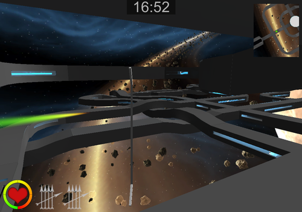
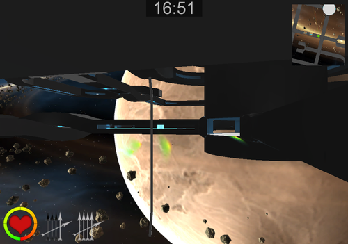
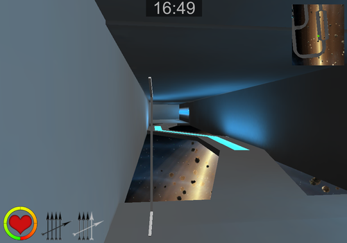

### Description
ArrowSpaceShooter is a game I worked on with one other programmer during my Bachelor’s degree.It’s a game we made using Unity3D in 1 month, with 2 people. It’s an online first-person shooter in a space station where your goal is to shoot other players with bow and arrow.

### Role: Programming, Art & Level Design
I mainly worked on the player’s movement and shooting part of the game as well as modelling the environment with Blender.

#### Platforms:
- PC

