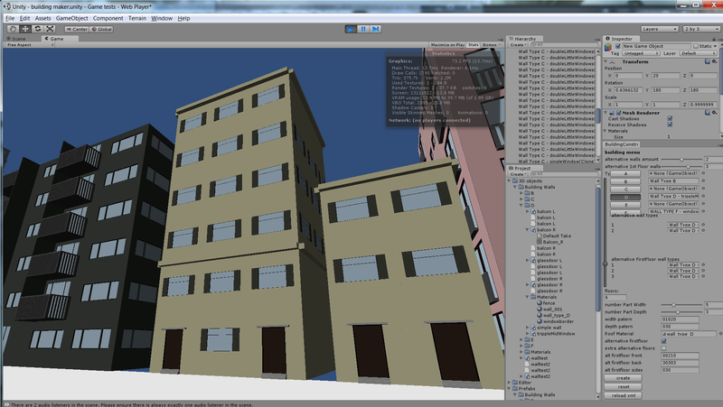
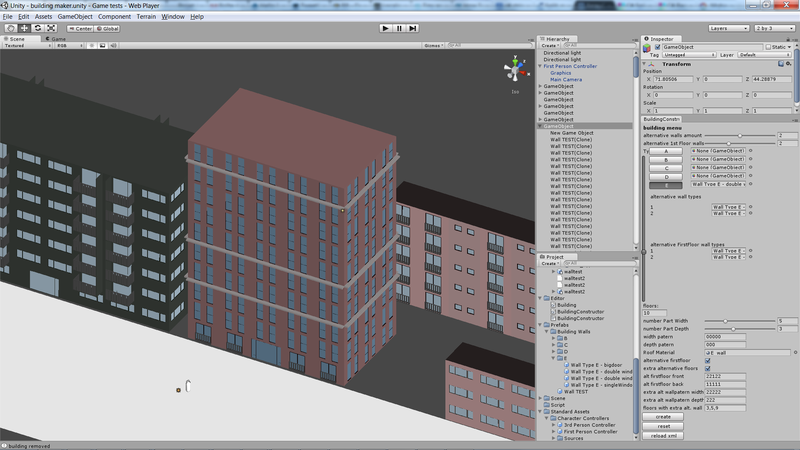
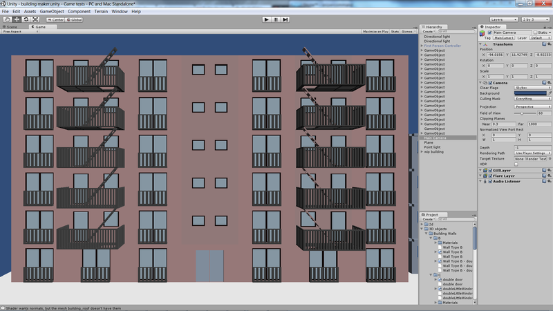

### Description
City of Shadows is my Bachelor’s degree final project. It’s a 3d open world game about a little boy lost in a colourless city that has lost all his confidence and his quest to find it back through challenges where he needs to overcome his fears. while he does these quests, he will regain colours and his powers, the city will find it’s colours back as well.

### Role: Programming, Art, Game Design
I worked with a team of 4 people on this project, one 2d artist, one musician, one scenarist and myself, I did all the programming, 3D modelling and level design. It was by far my most ambitious project at that point in time, and I learned a lot from it across multiple disciplines, including programming, team management, time management, learning to prioritise and cut features in advance.

#### Platforms:
- PC

I built custom tooling to composite buildings from wall tiles, to generate the city procedurally, to save time. 

