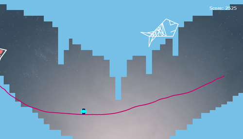
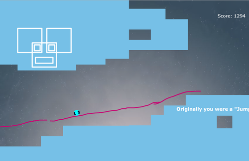
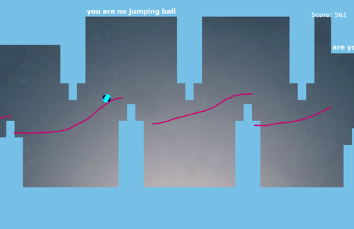

### Description
The goal of this game is in the name. Players need to draw lines on the panning scenery, to help the rolling ball reach the end of the level. This was a 3 person group project which we worked on it during 3 months during course hours and at home.

### Role: Programming & Level Design
I learned and helped my team to use Box2D with ActionScript, then researched and set-up a pipeline to create our levels with collisions. Then I made the levels, some art and created a little story that you can follow through the whole game.

#### Platforms:
- Flash

