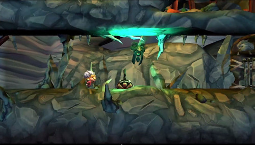
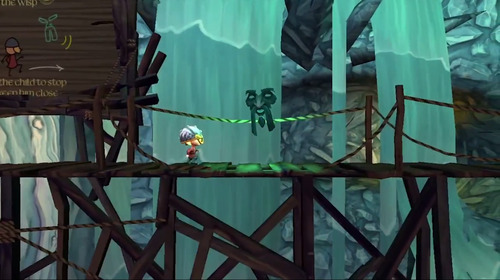
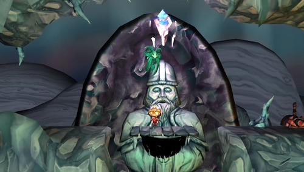


### Description
A side-on Platformer with themes of norse mythology.
This was a large group project & final project of my Masters course, delivered on both PS4 & PSVita, using Sony's proprietary PhyreEngine. 

### Role: Lead gameplay programmer 

#### Contributions
- Main character movements
- Moving platforms
- The event system 
- The renderer

#### Platforms:
[PS4]() | 
[PSVita]()

We worked in a team of around 15 people divided between programmers, artists and producers to produce a new IP together with Sony London Studio’s.
The duration of the project was 8 months, which gave us enough time to learn to use PhyreEngine, make our own framework and produce a good quality vertical slice

