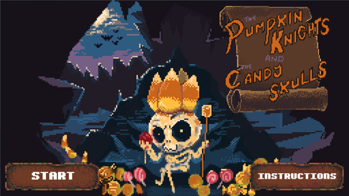


### Description
This game is based on the space invader gameplay mechanics but sideways and with a Halloween theme. It was made as part of a group project during my Masters degree (2 programmers, 2 artists), over the duration of 2 weeks.

### Role: Programmer 

#### Contributions
My role in the team was mainly programming the gameplay mechanics like the enemy waves and moving patterns, handling the shooting part of the game, involving resource management and collision detection. I also worked closely with the artists on the implementation of animations and a parallax effect.

#### Platforms:
- PC

