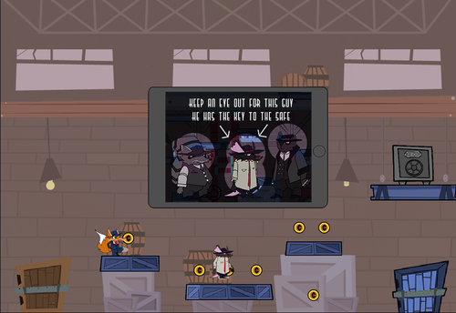
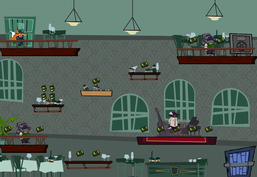
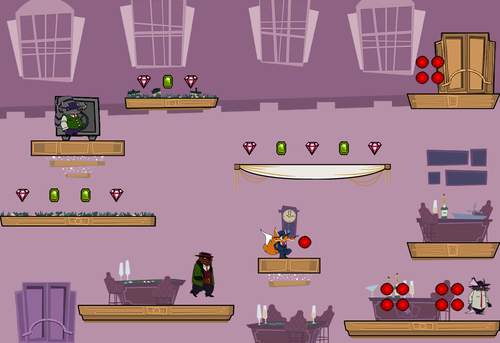


### Description
Squeakeasy Scuffle is  a 2d platformer on iPad where the player needs to go through 18 single screen levels, collecting money, jumping on enemies heads, opening safes, collecting stars. 

It's the second game I worked on during my Masters degree. We worked on the project in a team of 4 programmers, 4 artists and a couple producers during 3 months.

### Role: Programming
I worked mainly on the main character’s movement, level code, the saving system and reading the input from the touch screen.

#### Platforms:
- iPad

